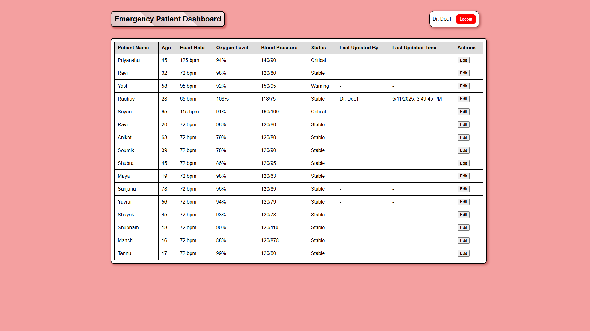

# Hospital Management System

A comprehensive web application designed to streamline hospital operations, prioritize patient care, and manage resources efficiently.

## Live Demo

🔗 [Hospital Management System](https://shubhrasankharoy.github.io/Hack-Mates/)

## Features

### 1. Patient Priority System
- Automatically arranges patients according to their triage level (Level 1 being most critical)
- Ensures critical patients receive immediate attention
- Displays patient status (Waiting, In Treatment, etc.)
- Tracks: Name, Age, Triage Level, Status

### 2. Resource Availability Tracker
- Real-time dashboard showing availability of:
  - Medical staff (Doctors, Nurses)
  - Facilities (Emergency Rooms, ICU, Operation Theaters, Wards)
  - Medical supplies (Oxygen, Blood, Ventilators, PPE)
- Admin-protected interface for updates
- Automatic email alerts when resources run low

### 3. Emergency Patient Dashboard
- Comprehensive view of all emergency patients
- Tracks vital statistics: Heart Rate, Oxygen Level, Blood Pressure
- Status indicators (Critical, Warning, Stable)
- Secure update functionality for medical staff with:
  - Staff identification
  - Timestamp tracking

### 4. Patient Monitoring System
- Complete patient records management:
  - Personal information (Name, ID, Age)
  - Room/Bed assignment
  - Medical history
  - Current status
- Search and filter capabilities
- Admin interface for adding/updating patient information

## Technologies Used

- **Frontend**: HTML5, CSS3, JavaScript
- **Backend**: Firebase (Authentication and Realtime Database)
- **Email Service**: EmailJS for automated notifications

## Screenshots

| Feature | Screenshot |
|---------|------------|
| Patient Priority System |  |
| Resource Tracker |  |
| Emergency Dashboard |  |
| Patient Monitoring |  |

## Installation

1. Clone the repository:
   ```sh
   git clone https://github.com/Shubhrasankharoy/Hack-Mates.git
   ```
2. Navigate to project directory:
   ```sh
   cd Hack-Mates
   ```
3. Set up Firebase:
    - Create a Firebase project at [Firebase Console](https://console.firebase.google.com/)
    - Add your configuration in `login_page.js` and `patient_prioritity_system.js`
    ```sh
    const firebaseConfig = {
        apiKey: "YOUR_API_KEY",
        authDomain: "YOUR_AUTH_DOMAIN",
        projectId: "YOUR_PROJECT_ID",
        storageBucket: "YOUR_STORAGE_BUCKET",
        messagingSenderId: "YOUR_SENDER_ID",
        appId: "YOUR_APP_ID",
        measurementId: "YOUR_MEASUREMENT_ID"
    };
    ```
4. Configure EmailJS:

    - Set up EmailJS account

    - Add public key, service ID and template ID in `resource-availability-tracker.js`
     ```sh
    const SERVICEID = 'YOUR_SERVICE_ID'
    const TEMPLATEID = 'YOUR_TEMPLATE_ID'
    const PUBLICKEY = 'YOUR_PUBLIC_KEY'
    ```
5. Open `index.html` in your browser

## License
  This project is licensed under the **MIT License**

## Team

**Team Name:** Hack Mates

### Contributors:
1. [Shubhra Sankha Roy](https://github.com/Shubhrasankharoy)  
2. [Arunava Kundu](https://github.com/Coolwatt)
3. [Soumik Parui](https://github.com/itssoumik)
4. [Priyanshu Kr. Thakur](https://github.com/Priyan437) 

## Thank You

We appreciate your interest in the Hospital Management System. If you have any questions, feedback, or suggestions, feel free to reach out to us via GitHub or email. Your support helps us improve and grow!
